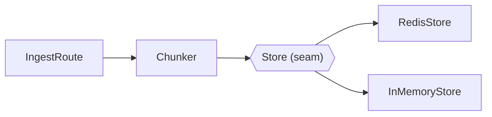

# Report Format

The report is a single markdown document with mermaid fences — that one format renders as a plain file, in a GitHub issue/PR comment, and in artifact pipelines, so the delivery medium never changes the writing. Diagrams carry the mechanism; prose is sparse, plain, and cited.

## Section order

```markdown
# <Topic> — architecture report

_Scope: <one-line boundary statement — what is in, what is out>._
_<repo> @ <short SHA>, <date>._

## Executive summary
## Inventory
## Structure
## Control flow
## Data flow
## Touchpoints
## Observations   <!-- only when the user asked for one -->
```

## Executive summary

A table, first thing after the scope line — the reader who stops here still leaves with the shape:

```markdown
| Module | Files | Role | Interface (the seam callers cross) |
|---|---|---|---|
| Guard | `src/guard/*.ts` (3) | Screens tool output before it reaches the model | `withGuard(call)` — `src/guard/index.ts:12` |
```

One row per module inside the boundary. Below the table, at most three sentences naming the topic's overall shape (pipeline, hub-and-spokes, layered, event-driven — whichever the diagrams will show).

## Inventory

Every file that is part of the topic, monospaced, grouped by module, one line each: path, role. This is the completeness proof for the whole report — a file discovered later that belongs to the topic means the inventory was wrong, not merely incomplete.

## Structure

The module map: which modules exist, where each seam sits, which adapters satisfy which interface. A mermaid `flowchart` is the workhorse:



Style seams distinctly (dashed or hexagon nodes) so the diagram distinguishes "calls" from "satisfies the interface at". One diagram per genuinely separate cluster — a single mega-graph of the whole topic stops carrying the mechanism at around a dozen nodes; split it before that.

## Control flow

The real path of a request/event/call through the topic, as a mermaid `sequenceDiagram` per distinct path (happy path first, then any divergent path that exists in source — error handling, retry, fan-out). Under each diagram, a numbered trace with a citation per step:

```markdown
1. `POST /ingest` lands in `src/routes/ingest.ts:41`
2. `chunk()` splits the body — `src/lib/chunker.ts:88`
3. …
```

The diagram and the trace show the same path; the trace carries the evidence.

## Data flow

What crosses each seam and where it rests: the shapes (types/schemas, cited to their definitions), the stores, and every point where data changes representation (serialized, embedded, redacted, aggregated). A `flowchart` with labelled edges usually beats a sequence diagram here — the labels name the payloads.

## Touchpoints

Two short tables — inbound (who calls into the topic, at which interface) and outbound (what the topic calls out to) — one line per edge, each cited. This section is the scope fence made visible: everything external lives here and only here.

## Evidence

- Every claim carries `path/from/repo/root.ts:123` (a range `:120-134` for a mechanism spanning lines). Cite the definition, not a call site, unless the call site is the claim.
- Verified means read: the line was read in this run of the analysis, not remembered or inferred from a name.
- Facts the source shows but the reader might doubt — dead registration, config nothing reads, two adapters where one is unused — get stated neutrally with the citation doing the arguing.

## Diagrams

A diagram earns its place when it carries the mechanism — when deleting it would force a paragraph of prose to say the same thing. A diagram restating an adjacent table is ballast; cut it. Every diagram gets a one-line caption saying what to look at. Mermaid only — it renders everywhere the report can land.

## Tone

Plain, descriptive, cited. The architectural nouns come from the `codebase-design` skill and the domain nouns from the project's glossary.

**Use exactly:** module, interface, implementation, seam, adapter, depth, leverage, locality.

**Never substitute:** component, service, unit (for module) · API, signature (for interface) · boundary (for seam).

**Phrasings that fit:**

- "The store seam has two adapters: Redis in prod (`src/store/redis.ts:14`), in-memory in tests (`src/store/memory.ts:9`)."
- "Every write funnels through `persist()` — the topic's one outbound touchpoint to the database."

The report states what is; verdict words (shallow, leaky, tangled, "should") appear only inside a user-requested Observations section. No hedging, no "it's worth noting". If a sentence could be a table row, make it a row.
